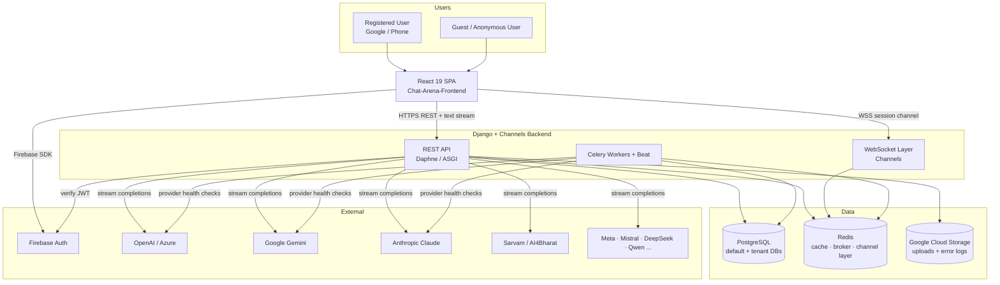
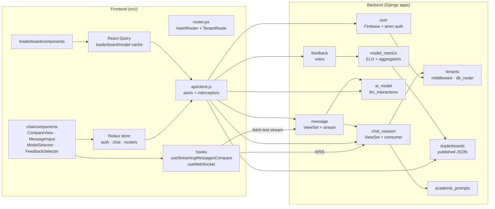
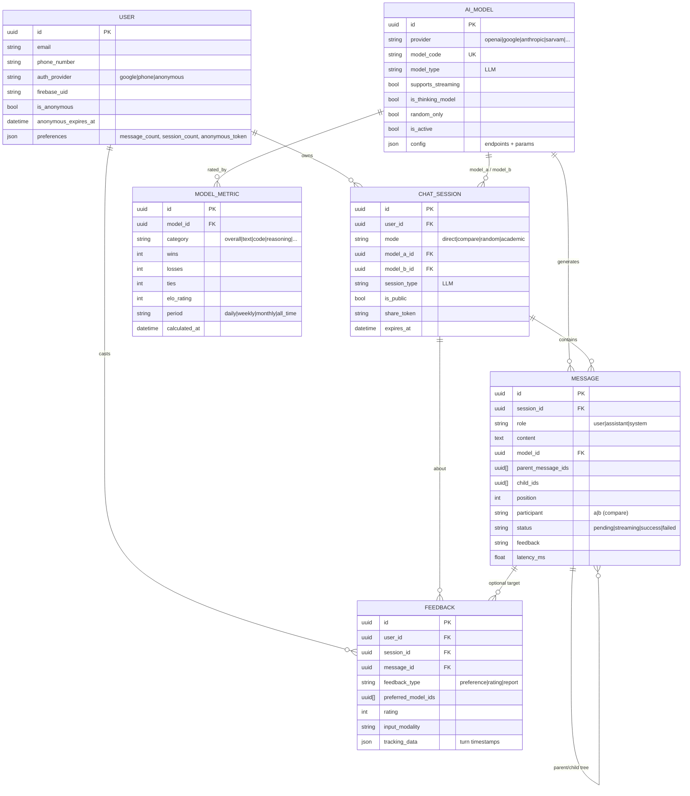
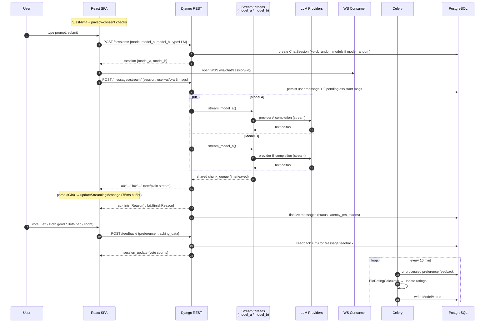
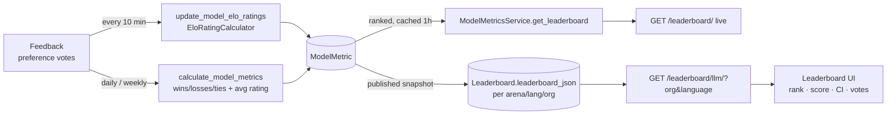

# Chat Arena — LLM Arena Architecture

> Scope: the **LLM (text/chat) arena** only. TTS, ASR, and OCR arenas are intentionally
> excluded. They reuse the same scaffolding (sessions, messages, feedback, leaderboards)
> but with modality-specific providers and UI.

---

## 1. System Context (C4 — Level 1)



**Roles**
- **Frontend** — single-page React app; renders the side-by-side arena, streams responses, collects votes.
- **REST API** — session/message/feedback/model/leaderboard endpoints; also proxies and streams LLM completions.
- **WebSocket layer** — per-session real-time channel (state sync, typing, broadcast); streaming itself goes over HTTP.
- **Celery** — async ELO updates, daily/weekly metric snapshots, model health checks, cleanup.
- **Redis** — Django cache, Celery broker/result backend, and Channels group layer.
- **PostgreSQL** — primary data store with a per-tenant database router.

---

## 2. Container / Module View (C4 — Level 2)



### Backend apps

| App | Responsibility | Key files |
|-----|----------------|-----------|
| `user` | Firebase JWT + anonymous-token auth, guest expiry/limits | `authentication.py`, `models.py` |
| `tenants` | URL-slug tenant detection, thread-local context, DB routing | `middleware.py`, `db_router.py`, `context.py` |
| `chat_session` | Session lifecycle (modes, share, duplicate, export), WS consumer | `views.py`, `services.py`, `consumers.py` |
| `message` | Messages, branching tree, **dual-model streaming** | `views.py` (`stream` action), `services.py` |
| `ai_model` | Model registry + provider dispatch + streaming generators | `models.py`, `llm_interactions.py`, `services.py` |
| `feedback` | Preference / rating / report votes | `models.py`, `views.py` |
| `model_metrics` | ELO ratings, win/loss aggregation, snapshots | `calculators.py`, `aggregators.py`, `services.py` |
| `leaderboards` | Published leaderboard JSON per arena/lang/org, contributors | `models.py`, `services.py` |
| `academic_prompts` | Curated benchmark prompts (used by random/academic modes) | `models.py` |

### Frontend layers

| Layer | Responsibility |
|-------|----------------|
| Routing | `app/router.jsx` — HashRouter; `TenantRoute` extracts `/:tenant/...` and sets `TenantContext`. |
| Global state (Redux) | `auth`, `chat` (sessions, messages, **streamingMessages**, turn timestamps), `models`. |
| Server cache (React Query) | Leaderboard tables, model lists — `staleTime 5m`. |
| API client | `shared/api/client.js` — axios with tenant-prefix, token injection, 401 refresh queue, fire-and-forget error logging. |
| Streaming hooks | `useStreamingMessagesCompare` (dual model), `useStreamingMessage` (direct), `useWebSocket` (session channel). |

---

## 3. Domain Model (ER)



**Notable design points**
- `Message` is a **DAG** via `parent_message_ids` / `child_ids` (GIN-indexed arrays) → supports branching and regeneration.
- In `compare`/`random` modes a single user turn fans out to **two assistant messages** distinguished by `participant ∈ {a, b}`.
- A `preference` vote is stored on `Feedback` (with `preferred_model_ids` + per-turn `tracking_data` timestamps) and **mirrored** onto the user `Message.feedback` field for quick render.
- Anonymous identity lives entirely in `User.preferences` (token + counters), so guests need no separate table.

---

## 4. The Arena Flow — Side-by-Side Compare

End-to-end sequence for one battle turn (`compare`/`random` mode):



### Streaming protocol (the important detail)

The arena does **not** use classic `data: {...}` SSE for completions. The `message.stream`
action returns a `StreamingHttpResponse(content_type='text/plain')` carrying a
**Vercel-AI-SDK-style line protocol**:

| Line prefix | Meaning |
|-------------|---------|
| `a0:"<text>"` | Model **A** content delta (JSON-escaped string) |
| `b0:"<text>"` | Model **B** content delta |
| `ad:{...}` | Model **A** done — `{"finishReason":"stop"}` or error payload |
| `bd:{...}` | Model **B** done |

Both models run **concurrently in background threads** (`stream_model_a`, `stream_model_b`)
that push tagged chunks into a shared `chunk_queue`; the response generator drains the queue
so A and B deltas interleave in one HTTP response. The client
(`useStreamingMessagesCompare.js`) reads `response.body.getReader()`, splits on newlines,
and routes each prefix into Redux `streamingMessages[sessionId][messageId]`, flushing to the
UI on a ~75 ms cadence to avoid render thrash.

The native `data:` SSE path in `message/streaming.py::StreamingManager` and the WebSocket
`message_update` broadcasts exist for **state sync / single-model** paths; the dual-model
battle uses the line protocol above.

---

## 5. Auth & Multi-Tenancy

```mermaid
flowchart TD
    A[App load] --> B{tokens in localStorage?}
    B -- yes --> C[GET /users/me/]
    C -- ok --> D[Authenticated / Anonymous session]
    C -- fail --> E[clear tokens]
    B -- no --> E
    E --> F[POST /auth/anonymous/<br/>→ anonymous_token + JWT]
    F --> D

    D --> G{user signs in}
    G -->|Google popup / Phone OTP| H[Firebase idToken]
    H --> I[POST /auth/google|phone/<br/>X-Anonymous-Token merges guest data]
    I --> D
```

- **Auth backends** (`user/authentication.py`): `FirebaseAuthentication` (JWT carrying Firebase `user_id`, checks active + anon expiry) and `AnonymousTokenAuthentication` (`X-Anonymous-Token` header).
- **Guest limits**: 30-day expiry; capped messages/sessions tracked in `User.preferences`; enforced client-side (`useGuestLimitations`) and server-side (daily message limit via `select_for_update`).
- **Token lifecycle**: axios response interceptor refreshes on 401 via `/auth/refresh/`, queuing concurrent requests; anonymous users (no refresh token) are re-bootstrapped.
- **Tenancy**: `TenantMiddleware` parses the leading `/:slug/` from the path → thread-local context → `db_router` selects that tenant's database. The frontend mirrors this: `TenantRoute` + the axios request interceptor auto-prefix every API call with the active tenant.

---

## 6. Leaderboard & Metrics Pipeline



Two leaderboard surfaces coexist:
- **Live metrics** (`model_metrics`) — ELO + win-rate computed from raw feedback, ranked and cached on read.
- **Published leaderboards** (`leaderboards`) — curated `leaderboard_json` snapshots filtered by `arena_type=llm`, `language`, and `organization` (AI4Bharat / Aquarium), plus a **top-contributors** view (vote counts by user, emails masked). This is what the frontend leaderboard table renders.

---

## 7. Async Jobs (Celery Beat)

| Schedule | Task | Purpose |
|----------|------|---------|
| every 10 min | `update_model_elo_ratings` | Convert new preference votes → ELO deltas |
| daily 00:00 | `calculate_model_metrics(daily)` | Win/loss/tie + avg-rating snapshot |
| Mondays | `calculate_model_metrics(weekly)` | Weekly snapshot |
| daily 02:00 | `cleanup_expired_anonymous_users` | GC expired guests |
| every 6 h | `validate_all_models` | Provider health check, deactivate broken models |
| monthly | `cleanup_old_metrics` | Archive stale metric rows |
| (on demand) | `generate_session_titles`, `export_session_batch` | Auto-title, bulk export |

---

## 8. Cross-Cutting Concerns

- **Rate limiting** (DRF throttles): anon 60/min, user 200/min, AI generation 30/min, auth 10/min; plus a hard per-user daily message cap enforced atomically.
- **Error logging**: frontend posts redacted error envelopes to `/logs/frontend-error/` (fire-and-forget, localStorage-queued offline); backend logs provider errors to GCS.
- **Privacy/consent**: first-message gate (`usePrivacyConsent`) recorded in localStorage + `User.preferences`.
- **Resilience**: WS reconnect with exponential backoff (max 5); stream retry wrapper; 401 refresh queue prevents thundering-herd refreshes.
- **CSRF**: API paths exempted (`ApiCsrfExemptMiddleware`); only `/admin/` and `/accounts/` enforce it.

---

## 9. Tech Stack Summary

| Layer | Technology |
|-------|-----------|
| Frontend | React 19, Redux Toolkit, React Query, React Router 7 (Hash), MUI + Tailwind, Framer Motion, Firebase SDK |
| Transport | Axios (REST), Fetch reader (text/plain line stream), native WebSocket (Channels) |
| Backend | Django + DRF, Django Channels (Daphne/ASGI), Celery + Beat |
| Data | PostgreSQL (multi-DB tenant router), Redis (cache/broker/channel layer), Google Cloud Storage |
| Auth | Firebase Auth (Google + Phone) + JWT (simplejwt) + anonymous tokens |
| LLM providers | OpenAI/Azure, Google Gemini, Anthropic, Sarvam/AI4Bharat, Meta, Mistral, DeepSeek, Qwen, … |
