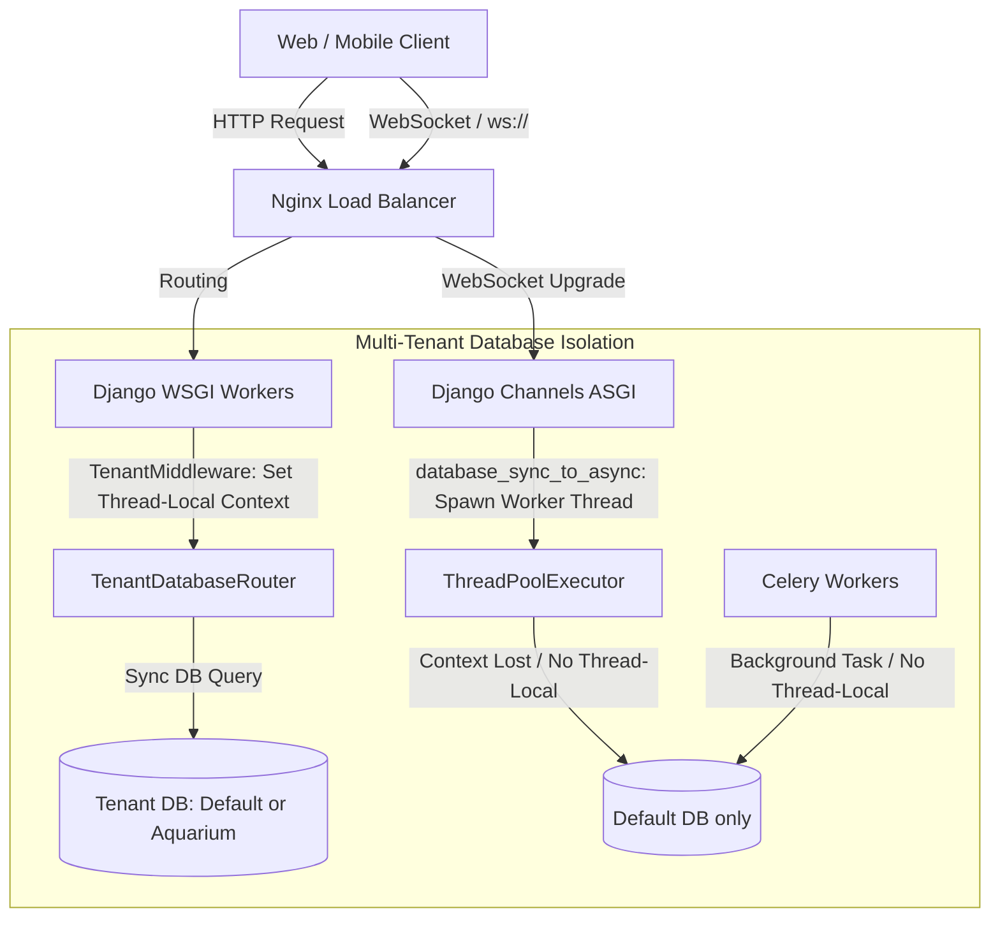

# Threat Modeling and Vulnerability Analysis Plan: Chat-Arena-Backend

This document outlines a plan for a deeper security analysis, threat modeling, and vulnerability assessment of the Chat-Arena-Backend codebase.

---

## 1. Executive Summary & Core Architectural Observations

An initial review of the codebase reveals several critical architectural decisions and potential vulnerabilities that require immediate attention and deeper validation.

### Key Architectural Findings:
1. **Multi-Tenant Context Isolation Leakage**:
   - The project uses `tenants.middleware.TenantMiddleware` and `tenants.db_router.TenantDatabaseRouter` to isolate client databases (e.g. `default` and `aquarium`) based on URL path prefixes (e.g. `/<tenant_slug>/...`).
   - The active tenant is stored in thread-local storage (`threading.local()`).
   - **The Vulnerability:** Under ASGI (Django Channels WebSockets) and background tasks (Celery), asynchronous functions delegate database access to different threads (e.g. via `database_sync_to_async` or separate worker processes). Thread-local context does **not** propagate across these boundaries. Consequently, all queries from WebSockets and Celery background workers default to the `default` database, leading to potential data leakage or application crashes when accessing tenant-specific records.
2. **Global Auth Key Sharing**:
   - A single global `SECRET_KEY` is shared across all tenants. There is no tenant-scoped authentication boundary. A JWT token issued under `tenant-A` is cryptographically valid for `tenant-B`. If UUID collisions occurred or account registration is open, a user could gain cross-tenant access.
3. **Broken & Dead WebSocket Middleware**:
   - `WebSocketAuthMiddleware` in [middleware.py](file:///Users/teddyreed/git/Chat-Arena-Backend/backend/user/middleware.py) references `UserService.verify_firebase_token(token)`, which does not exist in the codebase. This causes an `AttributeError` exception that defaults all connections to `AnonymousUser()`. While the `ChatSessionConsumer` bypasses this by implementing its own manual verification from query parameters, the dead code represents significant technical debt and potential future security gaps.
4. **Downstream API Path Traversal / SSRF**:
   - In [views.py](file:///Users/teddyreed/git/Chat-Arena-Backend/backend/message/views.py#L1409-L1420), `TransliterationAPIView` concatenates raw user input (`data` path parameter) directly into the target URL of a downstream request without URL encoding, enabling downstream path traversal or SSRF-like behavior.
5. **WebSocket Token Leakage**:
   - Passing access tokens in WebSocket query strings (`ws://...?token=...`) exposes sensitive credentials in server logs, proxy logs, and browser history.

---

## 2. Threat Modeling Framework

We will evaluate the system using the **STRIDE** methodology (Spoofing, Tampering, Repudiation, Information Disclosure, Denial of Service, Elevation of Privilege) focusing on three main trust boundaries:
1. **External API Trust Boundary**: Client to Nginx / Django HTTP endpoints.
2. **WebSocket & Connection Trust Boundary**: Client to Django Channels (ASGI).
3. **Internal Process Trust Boundary**: Django to Celery, Redis, and PostgreSQL.

### High-Risk Scenarios to Analyze:

| ID | STRIDE Category | Threat Scenario | Impact |
|:---|:---|:---|:---|
| **T1** | **Information Disclosure** / **Elevation of Privilege** | An attacker accesses `/other-tenant/sessions/` using a token generated on their own tenant. | Cross-tenant data breach. |
| **T2** | **Tampering** / **Information Disclosure** | An asynchronous WebSocket connection or Celery worker queries tenant data. Since thread-local tenant context is lost, the query falls back to the `default` database, polluting database tables or leaking records. | Data corruption and cross-tenant leakage. |
| **T3** | **Information Disclosure** | A user token leaks through Nginx logs because it was passed in the WebSocket connection query string. | Account hijacking. |
| **T4** | **Tampering** (SSRF / Downstream Traversal) | An attacker inputs traversal strings (`../../`) in `TransliterationAPIView` to reach unauthorized endpoints on the transliteration API. | Downstream service abuse or data disclosure. |
| **T5** | **Elevation of Privilege** | Missing CSRF protection on API endpoints due to `ApiCsrfExemptMiddleware` if any endpoints mistakenly fall back to Django session cookies for auth. | CSRF-based session takeover. |
| **T6** | **Denial of Service** (Resource Exhaustion) | Large files uploaded to `/api/messages/upload_document/` are parsed by downstream document extractors in the request thread, causing Gunicorn worker exhaustion. | Denial of Service (DoS) for the entire app. |

---

## 3. Plan for Deeper Security Analysis

We will run a multi-phase security review to confirm the threats, search for additional vulnerabilities, and recommend mitigations.

### Phase 1: Dynamic Validation of Multi-Tenancy (Proof-of-Concept Tests)
* **Goal**: Prove if tenant context is leaked or defaulted under async and WebSocket scenarios.
* **Steps**:
  1. Create a script in the [scratch](file:///Users/teddyreed/.gemini/jetski/scratch) directory that simulates an async connection using `database_sync_to_async` and logs the database alias returned by `TenantDatabaseRouter`.
  2. Attempt to connect to a WebSocket session belonging to `tenant-B` (stored in the `aquarium` DB) using `ChatSessionConsumer` and verify if the lookup fails or incorrectly queries the `default` DB.
  3. Validate if periodic Celery tasks (like ELO recalculations or title generation) run queries on the correct tenant databases or fall back to the default database.

### Phase 2: Static Code Auditing for IDOR & Injection Points
* **Goal**: Ensure all Django ViewSets enforce strict ownership checks.
* **Steps**:
  1. Audit [views.py](file:///Users/teddyreed/git/Chat-Arena-Backend/backend/chat_session/views.py) and [views.py](file:///Users/teddyreed/git/Chat-Arena-Backend/backend/message/views.py) to confirm every action checks `IsSessionOwner` or `IsMessageOwner`.
  2. Inspect endpoints utilizing raw SQL queries or `extra()` methods (if any) for SQL injection risks.
  3. Review file upload logic in `upload_image`, `upload_audio`, and `upload_document` for restricted file extensions and path traversal when saving files.

### Phase 3: Vulnerability Scanning & Supply Chain Analysis
* **Goal**: Identify vulnerable dependencies and coding anti-patterns.
* **Steps**:
  1. Since the Sonatype MCP server is not to be used, run local static analysis using `bandit` to identify Python-specific vulnerability patterns.
  2. Parse [requirements.txt](file:///Users/teddyreed/git/Chat-Arena-Backend/backend/deploy/requirements.txt) using local command-line tools (such as `pip-audit` or `safety`) to check for CVEs in pinned versions.
  3. Review the base Docker images in the `Dockerfile` to confirm they are kept up to date.

---

## 4. Remediation & Hardening Targets

The deeper analysis will culminate in implementing the following security fixes:

1. **Context Management Refactor**:
   - Migrate tenant context tracking from thread-local storage (`threading.local()`) to Python's `contextvars` (which is async-safe and automatically propagates across coroutines).
   - Update `TenantDatabaseRouter` to retrieve the database configuration using `contextvars`.
2. **WebSocket & Celery Tenant-Awareness**:
   - Ensure the tenant slug is passed in WebSocket endpoints (e.g. `ws/<tenant_slug>/chat/session/<session_id>/`) or headers, and populate the async-safe context variable during connection handshake.
   - Refactor Celery tasks to accept a `tenant_slug` parameter and set the context explicitly inside the task runtime.
3. **SSRF and Path Traversal Mitigations**:
   - Update `TransliterationAPIView` to URL-encode the `data` parameter before appending it to downstream request paths, or migrate to POST requests with JSON payloads.
4. **WebSocket Authentication Cleanup**:
   - Remove unused and broken `WebSocketAuthMiddleware`.
   - Implement header-based authentication for WebSockets (if supported by the client) or design a short-lived one-time ticket system to exchange JWTs for WebSocket connection tokens (avoiding long-lived token exposure in query strings).
5. **Clean Django Settings**:
   - Remove invalid `https://` schemas and incorrect ports from `ALLOWED_HOSTS`.

---

## 5. Next Steps & Action Request

To proceed with this plan, we should coordinate on:
1. **Creating the PoC tests** to validate the multi-tenancy thread-local isolation leak.
2. **Setting up local static analysis** (`bandit`, `pip-audit`) within the workspace to scan Python code and dependencies.

Let me know if you would like me to begin implementing the Phase 1 dynamic validation scripts!
